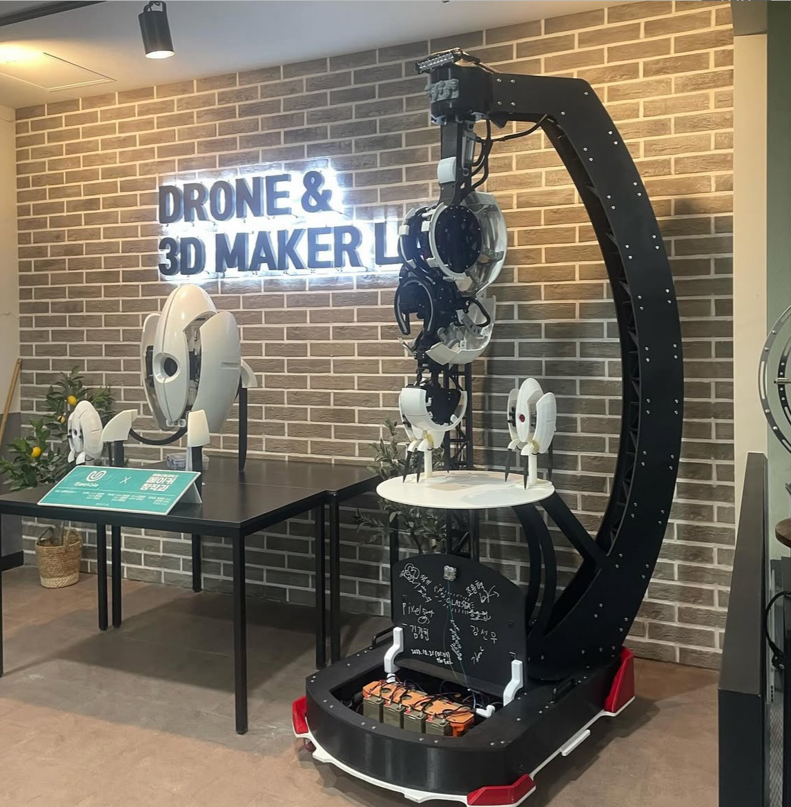

<div align="center">

# 🤖 Glaisser

### GLaDOS Artificial Intelligence Security Robot

*AI 기반 학교 보안 순찰 로봇*


**Topics**:  `ai` `yolov5` `roboflow` `nodejs` `socket` `web` `javascript` `python`

**Homepage**: [www.glaisser.com:3000](http://www.glaisser.com:3000)

---

### 🎬 Demo Video

[](https://www.youtube.com/watch?v=UGUaFJ-2woI)

**▶️ 클릭하여 작동 영상 보기**

*GLaDOS AI Security Robot의 실제 작동 모습*

---

### 📸 System Preview



*GLaDOS AI Security Robot - 학교 순찰 로봇*

</div>

---

## 📋 목차

- [프로젝트 소개](#-프로젝트-소개)
- [시스템 아키텍처](#-시스템-아키텍처)
- [하드웨어 구성](#-하드웨어-구성)
- [회로 핀맵](#-회로-핀맵)
- [Arduino 코드 분석](#-arduino-코드-분석)
- [소프트웨어 스택](#-소프트웨어-스택)
- [설치 방법](#-설치-방법)
- [사용 방법](#-사용-방법)

---

## 🎯 프로젝트 소개

**Glaisser**는 Portal 게임의 GLaDOS에서 영감을 받은 **AI 기반 학교 보안 순찰 로봇**입니다. 

### 🌟 특징

- 🚨 **자동 순찰**:  라인 트레이싱 기반 자율 주행
- 📹 **AI 비전**: YOLOv5 + Roboflow 객체 감지
- 🤖 **DYNAMIXEL 제어**: 4개 서보 모터로 머리 움직임
- 🌐 **웹 모니터링**: Node.js + Socket.io 실시간 제어
- 🔊 **음성 안내**: TTS 기반 상황 알림

---

## 🏗️ 시스템 아키텍처

```
Glaisser 로봇
├── 메인 제어 (Arduino Uno)
│   ├── DYNAMIXEL 서보 4개
│   ├── 리니어 액추에이터
│   └── 신호 제어
│
├── 주행 제어 (Arduino Uno)
│   ├── DC 모터 4개
│   ├── 라인 센서 4개
│   └── 모터 드라이버
│
└── ESP32-CAM
    └── 영상 스트리밍

         ↓ Socket 통신

Node.js 웹 서버
- Socket.io
- 실시간 제어

         ↓ HTTP

Python AI 서버
- YOLOv5
- Roboflow
```

---

## 🛠️ 하드웨어 구성

### BOM (Bill of Materials)

| 부품 | 수량 | 용도 | 비고 |
|------|------|------|------|
| Arduino Uno | 2 | 메인 컨트롤러 | 메인 + 주행 |
| DYNAMIXEL AX-12A | 4 | 서보 모터 | ID 1-4 |
| DYNAMIXEL Shield | 1 | 모터 드라이버 | - |
| 라인 센서 | 4 | 라인 트레이싱 | 좌우 2개씩 |
| DC 모터 | 4 | 구동 바퀴 | 좌우 2개씩 |
| 모터 드라이버 | 2 | DC 모터 제어 | L298N |
| 리니어 액추에이터 | 1 | 수직 이동 | 11초 행정 |
| LED | 다수 | 상태 표시 | - |
| ESP32-CAM | 1 | 영상 스트리밍 | - |
| 배터리 | 2 | 전원 공급 | 12V |

---

## 🔌 회로 핀맵

### 메인 Arduino (DYNAMIXEL + 리니어 제어)

**Arduino Uno 핀 연결:**

```
Arduino Uno (메인)
├── Digital Pin 3 → OUTPUT (신호 송신 - 주행 Arduino)
├── Digital Pin 4 → OUTPUT (카메라 트리거)
├── Digital Pin 5 → INPUT (실행 버튼)
├── Digital Pin 7 → DXL Shield RX (SoftwareSerial)
├── Digital Pin 8 → DXL Shield TX (SoftwareSerial)
├── 5V → 센서 전원
└── GND → 공통 접지

DYNAMIXEL Shield
├── TTL Port → DYNAMIXEL ID 1 (Pitch - 상하 각도)
├── TTL Port → DYNAMIXEL ID 2 (Yaw - 좌우 고개)
├── TTL Port → DYNAMIXEL ID 3 (리니어 연동)
├── TTL Port → DYNAMIXEL ID 4 (Pan - 좌우 회전)
└── 12V Power → 외부 전원

리니어 액추에이터 (Motor Shield)
├── M1 (PWM) → 속도 제어 (±225)
└── GND → 공통 접지
```

**핀 기능 요약:**

| 핀 번호 | 타입 | 기능 | 상세 |
|---------|------|------|------|
| 3 | OUTPUT | 주행 신호 | 주행 Arduino로 시작 신호 전송 |
| 4 | OUTPUT | 카메라 신호 | AI 서버 트리거 |
| 5 | INPUT | 실행 버튼 | HIGH = 로봇 작동 시작 |
| 7 | RX | DYNAMIXEL RX | SoftwareSerial 수신 |
| 8 | TX | DYNAMIXEL TX | SoftwareSerial 송신 |

---

### 주행 Arduino (라인 트레이싱 + 모터 제어)

**Arduino Uno 핀 연결:**

```
Arduino Uno (주행)
├── Digital Pin 2 → OUTPUT (Switch/LED 상태 표시)
├── Digital Pin 3 → INPUT (메인 신호 수신)
├── Digital Pin 4 → INPUT (카메라 OK 신호)
├── Digital Pin 5 → OUTPUT (리니어 제어 신호)
├── Digital Pin 6 → OUTPUT (완료 신호)
├── Digital Pin 7 → OUTPUT (모터 드라이버 방향1)
├── Digital Pin 8 → OUTPUT (모터 드라이버 방향2)
├── Digital Pin 9 → PWM (왼쪽 모터 속도)
├── Digital Pin 10 → PWM (오른쪽 모터 속도)
├── Analog Pin A0 → 왼쪽 라인 센서
├── Analog Pin A1 → 오른쪽 라인 센서
├── 5V → 센서 전원
└── GND → 공통 접지

모터 드라이버 (L298N)
├── IN1 → Digital Pin 7
├── IN2 → Digital Pin 8
├── ENA → Digital Pin 9 (PWM)
├── ENB → Digital Pin 10 (PWM)
├── OUT1 → 왼쪽 모터 +
├── OUT2 → 왼쪽 모터 -
├── OUT3 → 오른쪽 모터 +
├── OUT4 → 오른쪽 모터 -
├── 12V → 배터리
└── GND → 공통 접지
```

**핀 기능 요약:**

| 핀 번호 | 타입 | 기능 | 상세 |
|---------|------|------|------|
| 2 | OUTPUT | Switch/LED | 상태 표시 LED |
| 3 | INPUT | 메인 신호 | HIGH = 주행 시작 |
| 4 | INPUT | 카메라 OK | AI 분석 완료 신호 |
| 5 | OUTPUT | 리니어 제어 | 메인 Arduino에 신호 |
| 6 | OUTPUT | 완료 신호 | 라인 트레이싱 종료 |
| 7 | OUTPUT | 모터 방향1 | IN1 (L298N) |
| 8 | OUTPUT | 모터 방향2 | IN2 (L298N) |
| 9 | PWM | 왼쪽 모터 속도 | 0-255 |
| 10 | PWM | 오른쪽 모터 속도 | 0-255 |
| A0 | ANALOG | 왼쪽 라인 센서 | 0-1023 (임계값 500) |
| A1 | ANALOG | 오른쪽 라인 센서 | 0-1023 (임계값 500) |

---

### DYNAMIXEL 서보 모터 설정

**DYNAMIXEL ID 및 기능:**

| ID | 모델 | 초기 위치 | 동작 범위 | 기능 | 모드 |
|----|------|-----------|-----------|------|------|
| 1 | AX-12A | 1000 | 0-1000 | Pitch (상하 각도) | OP_POSITION |
| 2 | AX-12A | 512 | 212-812 | Yaw (좌우 고개) | OP_POSITION |
| 3 | AX-12A | 2000 / 10000 | 2000-19000 | 리니어 연동 | OP_EXTENDED_POSITION |
| 4 | AX-12A | 4000 | 0-8000 | Pan (좌우 회전) | OP_EXTENDED_POSITION |

**속도 설정:**
- **ID 1**: 10 steps / 60ms (부드러운 상하 움직임)
- **ID 2**: 300 steps / 250ms (고개 흔들기)
- **ID 3**: Extended Position (리니어와 동기화)
- **ID 4**: Extended Position (좌우 스캔)

---

## 💻 Arduino 코드 분석

### 메인 Arduino (DYNAMIXEL 제어)

#### Setup (초기화)

```cpp
void setup() {
    Serial.begin(9600);
    
    // 핀 모드 설정
    pinMode(3, OUTPUT);  // 주행 신호
    pinMode(4, OUTPUT);  // 카메라 신호
    pinMode(5, INPUT);   // 실행 버튼
    
    // DYNAMIXEL 초기화
    dxl.begin(9600);
    dxl.setPortProtocolVersion(1.0);
    
    // ID 1:  Pitch (상하)
    dxl.ping(DXL_ID1);
    dxl.torqueOff(DXL_ID1);
    dxl.setOperatingMode(DXL_ID1, OP_POSITION);
    dxl.torqueOn(DXL_ID1);
    dxl.setGoalPosition(DXL_ID1, 1000);
    
    // ID 2: Yaw (좌우 고개)
    dxl.ping(DXL_ID2);
    dxl.torqueOff(DXL_ID2);
    dxl.setOperatingMode(DXL_ID2, OP_POSITION);
    dxl.torqueOn(DXL_ID2);
    dxl.setGoalPosition(DXL_ID2, 512);
    
    // ID 3: 리니어 연동
    dxl.ping(DXL_ID3);
    dxl.torqueOff(DXL_ID3);
    dxl.setOperatingMode(DXL_ID3, OP_EXTENDED_POSITION);
    dxl.torqueOn(DXL_ID3);
    dxl.setGoalPosition(DXL_ID3, 10000);
    
    // ID 4: Pan (좌우 회전)
    dxl.ping(DXL_ID4);
    dxl.torqueOff(DXL_ID4);
    dxl.setOperatingMode(DXL_ID4, OP_EXTENDED_POSITION);
    dxl.torqueOn(DXL_ID4);
    dxl.setGoalPosition(DXL_ID4, 4000);
}
```

---

#### Loop (메인 루프)

```cpp
void loop() {
    int run_g = digitalRead(5);  // 실행 버튼
    
    if (run_g == HIGH) {
        // 1.  상승 동작
        while (dmx_1_angle <= 1000) {
            dmx_1_up();      // ID 1 상승
            dmx3_down();     // ID 3 하강
            linier_down();   // 리니어 하강
        }
        
        // 2. 고개 흔들기 (ID 2)
        dxl.setGoalPosition(DXL_ID2, 812);  // 오른쪽
        delay(250);
        dxl.setGoalPosition(DXL_ID2, 512);  // 중앙
        delay(250);
        dxl.setGoalPosition(DXL_ID2, 212);  // 왼쪽
        delay(250);
        dxl.setGoalPosition(DXL_ID2, 512);  // 중앙
        delay(250);
        
        // 3. 리니어 상승
        dxl.setGoalPosition(DXL_ID3, 10000);
        delay(2000);
        
        // 4. 주행 신호 전송
        digitalWrite(3, HIGH);
        delay(10);
        digitalWrite(3, LOW);
        delay(13000);
        
        // 5. 카메라 트리거
        digitalWrite(4, HIGH);
        delay(10);
        digitalWrite(4, LOW);
    }
}
```

---

#### DYNAMIXEL 제어 함수

```cpp
// ID 1 하강 (부드러운 움직임)
void dmx_1_down() {
    unsigned long time = millis();
    
    if (time - previoustime1 >= 60) {  // 60ms 간격
        previoustime1 = time;
        if (dmx_1_angle != 0 && dmx_1_angle <= 1000) {
            dmx_1_angle -= 10;
            dxl.setGoalPosition(DXL_ID1, dmx_1_angle);
        }
    }
}

// ID 1 상승
void dmx_1_up() {
    unsigned long time = millis();
    
    if (time - previoustime1 >= 60) {
        previoustime1 = time;
        if (dmx_1_angle != 1000 && dmx_1_angle >= 0) {
            dmx_1_angle += 10;
            dxl. setGoalPosition(DXL_ID1, dmx_1_angle);
        }
    }
}

// 리니어 액추에이터 제어
void linear_down() {
    linear. setSpeed(225);   // 하강 (11초)
}

void linear_up() {
    linear.setSpeed(-225);  // 상승 (11초)
}

// ID 3 리니어 동기화
void dmx3_up() {
    dxl.torqueOff(DXL_ID3);
    dxl.setOperatingMode(DXL_ID3, OP_EXTENDED_POSITION);
    dxl.torqueOn(DXL_ID3);
    dxl.setGoalPosition(DXL_ID3, 19000);
}

void dmx3_down() {
    dxl.torqueOff(DXL_ID3);
    dxl.setOperatingMode(DXL_ID3, OP_EXTENDED_POSITION);
    dxl.torqueOn(DXL_ID3);
    dxl.setGoalPosition(DXL_ID3, 2000);
}
```

---

### 주행 Arduino (라인 트레이싱)

#### Setup (초기화)

```cpp
void setup() {
    Serial.begin(9600);
    
    // 핀 모드 설정
    pinMode(7, OUTPUT);  // 모터 제어
    pinMode(6, OUTPUT);  // 완료 신호
    pinMode(3, INPUT);   // 메인 신호
    pinMode(4, INPUT);   // 카메라 OK
    pinMode(5, OUTPUT);  // 리니어
    pinMode(2, OUTPUT);  // LED
    
    digitalWrite(5, LOW);
    digitalWrite(2, LOW);
    
    // 메인 신호 대기
    while (true) {
        if (Serial.available()) {
            cmd = Serial.read();
            if (cmd == '2') {
                flage = 1;
                digitalWrite(6, HIGH);
                delay(10);
                digitalWrite(6, LOW);
                break;
            }
        }
    }
}
```

---

#### Loop (라인 트레이싱)

```cpp
void loop() {
    // 라인 센서 읽기
    int leftSensorValue = analogRead(A0);
    int rightSensorValue = analogRead(A1);
    
    // 신호 확인
    int ok_sign = digitalRead(4);
    int cam_sign = digitalRead(3);
    
    digitalWrite(2, HIGH);  // LED ON
    
    // 기본 전진
    forward();
    
    // 라인 트레이싱
    if (leftSensorValue > 500 && rightSensorValue < 500) {
        turnleft();
        delay(20);
    }
    else if (rightSensorValue > 500 && leftSensorValue < 500) {
        turnright();
        delay(20);
    }
    else if (leftSensorValue > 500 && rightSensorValue > 500) {
        stop();
        delay(10);
    }
    
    delay(5);
}
```

---

#### 모터 제어 함수

```cpp
void forward() {
    leftMotor.setSpeed(150);
    rightMotor.setSpeed(150);
}

void backward() {
    leftMotor.setSpeed(-150);
    rightMotor.setSpeed(-150);
}

void turnleft() {
    leftMotor.setSpeed(-250);
    rightMotor.setSpeed(250);
}

void turnright() {
    leftMotor.setSpeed(250);
    rightMotor.setSpeed(-250);
}

void stop() {
    leftMotor.setSpeed(0);
    rightMotor.setSpeed(0);
}
```

---

## 📊 소프트웨어 스택

### Backend

| 기술 | 용도 | 비율 |
|------|------|------|
| Node.js | 웹 서버 | - |
| Socket.io | 실시간 통신 | - |
| Python | AI 서버 | 6.6% |
| YOLOv5 | 객체 감지 | - |
| Roboflow | AI 플랫폼 | - |

### Frontend

| 기술 | 용도 | 비율 |
|------|------|------|
| EJS | 템플릿 엔진 | 18.7% |
| JavaScript | 동적 기능 | 15% |
| CSS | 스타일 | 26.4% |
| SCSS | 스타일 전처리 | 17.1% |

### Embedded

| 기술 | 용도 | 비율 |
|------|------|------|
| C++ (Arduino) | 로봇 제어 | 16.2% |
| DYNAMIXEL SDK | 서보 제어 | - |

---

## 📦 설치 방법

### 1. 저장소 클론

```bash
git clone https://github.com/Deamonio/Glaisser.git
cd Glaisser
```

---

### 2. Arduino 라이브러리 설치

**필수 라이브러리:**

1. **Dynamixel2Arduino**
   ```
   스케치 → 라이브러리 포함하기 → 라이브러리 관리
   검색: "Dynamixel2Arduino"
   설치
   ```

2. **Adafruit Motor Shield**
   ```
   검색: "Adafruit Motor Shield V2"
   설치
   ```

---

### 3. Arduino 코드 업로드

**메인 Arduino:**
```bash
# Arduino IDE에서 열기
Arduino_Glados Robot/1층/Geekbl_GLaDOS_1/Geekbl_GLaDOS_1.ino

# 보드:  Arduino Uno
# 포트: COM3 (또는 /dev/ttyUSB0)
# 업로드
```

**주행 Arduino:**
```bash
# Arduino IDE에서 열기
Arduino_Glados Robot/1층/Geekble_GLaDOS_Drive_1/Geekble_GLaDOS_Drive_1.ino

# 보드: Arduino Uno
# 포트:  COM4 (또는 /dev/ttyUSB1)
# 업로드
```

---

### 4. Node.js 서버 설치

```bash
cd Web
npm install
```

---

### 5. Python AI 서버 설치

```bash
cd middle_medium(client)
pip install -r requirements. txt
```

---

## 🚀 사용 방법

### 1️⃣ 시스템 시작

1. **Arduino 전원 ON**
   ```
   메인 Arduino → 12V 배터리
   주행 Arduino → 12V 배터리
   DYNAMIXEL → 외부 12V 전원
   ```

2. **Node.js 서버 실행**
   ```bash
   cd Web
   node app.js
   # http://localhost:3000
   ```

3. **Python AI 서버 실행**
   ```bash
   cd middle_medium(client)
   python main.py
   ```

---

### 2️⃣ 로봇 작동

**작동 시나리오:**

1. **대기 모드**
   ```
   DYNAMIXEL ID 1: 1000 (상승 위치)
   리니어:  상승 위치
   ```

2. **실행 버튼 (Pin 5 HIGH)**
   ```
   ID 1 하강 (1000 → 0)
   ID 3 하강 (10000 → 2000)
   리니어 하강 (11초)
   ```

3. **고개 흔들기 (ID 2)**
   ```
   512 → 812 → 512 → 212 → 512
   (0.25초 간격)
   ```

4. **주행 시작 (Pin 3 신호)**
   ```
   HIGH → 10ms → LOW
   주행 Arduino 시작
   ```

5. **라인 트레이싱**
   ```
   센서 값 > 500 → 검은색 감지
   → 좌/우 회전
   → 양쪽 감지 → 정지
   ```

6. **카메라 트리거 (Pin 4)**
   ```
   HIGH → 10ms → LOW
   AI 서버 YOLOv5 추론
   ```

---

## 📊 성능 지표

### 시스템 성능

| 항목 | 성능 |
|------|------|
| 라인 트레이싱 속도 | 150 PWM (전진) |
| 회전 속도 | 250 PWM |
| DYNAMIXEL 응답 시간 | 60ms/step |
| 리니어 이동 시간 | 11초 (전체 행정) |
| 라인 센서 임계값 | 500 (0-1023) |

---

## 🔧 문제 해결

### 1. DYNAMIXEL 통신 실패

**증상:**
```
Ping failed for ID 1-4
```

**해결:**
```bash
# 1. 보드 레이트 확인
9600 bps (일치 확인)

# 2. 전원 확인
12V 외부 전원 연결

# 3. DYNAMIXEL Wizard로 ID 확인
각 모터 ID:  1, 2, 3, 4
```

---

### 2. 라인 트레이싱 오작동

**증상:**
- 선을 제대로 따라가지 못함

**해결:**
```cpp
// 임계값 조정
int line_limit = 500;  // 기본값
// 환경에 따라 300-700 조정

// 시리얼 모니터로 확인
Serial.print("Left:  ");
Serial.print(leftSensorValue);
Serial.print(" Right: ");
Serial.println(rightSensorValue);
```

---

### 3. 신호 통신 실패

**증상:**
- 주행 Arduino가 메인 신호 미수신

**해결:**
```cpp
// 신호 지속 시간 증가
digitalWrite(3, HIGH);
delay(100);  // 10ms → 100ms
digitalWrite(3, LOW);
```

---

## 🚀 향후 개선 사항

- [ ] 자율 주행 (GPS 연동)
- [ ] 음성 인식 명령
- [ ] 모바일 앱 제어
- [ ] 배터리 모니터링
- [ ] 장애물 회피 센서

---

## 🤝 기여하기

기여는 언제나 환영합니다! 🎉

### 기여 방법

1. Fork 이 저장소
2. Feature 브랜치 생성:  `git checkout -b feature/AmazingFeature`
3. 변경사항 커밋: `git commit -m 'Add some AmazingFeature'`
4. 브랜치에 Push: `git push origin feature/AmazingFeature`
5. Pull Request 생성

---

## 📜 라이선스

이 프로젝트는 MIT License 하에 배포됩니다.

---

## 📞 연락처

<div align="center">

### 프로젝트 관리자:  Deamonio

[](mailto:hyun0810d@gmail. com)
[](https://github.com/Deamonio)

**프로젝트 링크**:  [https://github.com/Deamonio/Glaisser](https://github.com/Deamonio/Glaisser)

**Homepage**: [www.glaisser.com:3000](http://www.glaisser.com:3000)

</div>

---

## 🙏 감사의 말

| Node.js | YOLOv5 | Roboflow | DYNAMIXEL |
|---------|--------|----------|-----------|
| 웹 서버 | AI 모델 | AI 플랫폼 | 서보 모터 |

**특별 감사:**
- 🤖 **ROBOTIS** - DYNAMIXEL 기술 지원
- 🎓 **Roboflow** - AI 플랫폼
- 🎮 **Valve** - GLaDOS 영감
- 💡 **팀원들** - 개발 열정

---

<div align="center">

## ⭐ 이 프로젝트가 마음에 드셨다면 Star를 눌러주세요! 

[](https://star-history.com/#Deamonio/Glaisser&Date)

---

**Made with 🤖 by Deamonio**

*"The cake is a lie, but the robot is real!"*

---

**© 2023 Deamonio. All rights reserved.**

[⬆ 맨 위로 돌아가기](#-glaisser)

</div>
